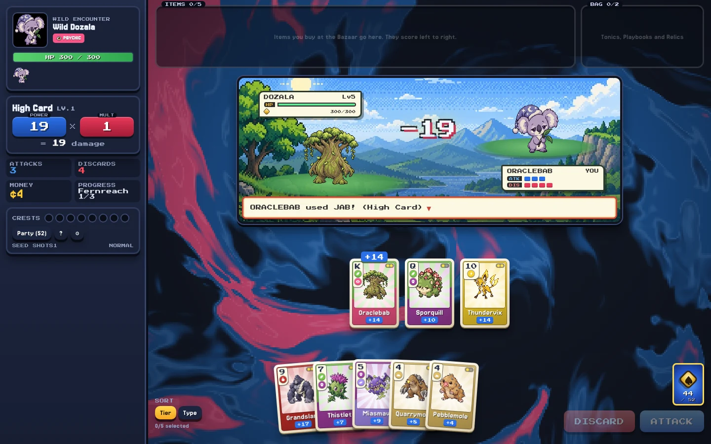

# Pocket Aces

A creature-collecting poker roguelike for the browser. Your deck is your party of **Pips**: evolution families are ranks, types are suits, and you play poker hands through eight regions of Pit Bosses to the High Rollers and the Kingpin at the Grand Table.



Inspired by [Balatro](https://www.playbalatro.com/) by LocalThunk, whose design this game adores. Design notes are in [`DESIGN.md`](DESIGN.md).

## Run it

```sh
pnpm install
pnpm dev          # http://localhost:5173
pnpm build        # type-check + production build into dist/
pnpm test         # hand-evaluator checks
pnpm ip-audit     # fails if any tracked file contains third-party franchise terms
```

## Deploy

The app is a static SPA. `wrangler.jsonc` serves `dist/` from a Cloudflare Worker with static assets (no bindings, no secrets):

```sh
pnpm exec wrangler login   # once
pnpm run deploy            # vite build && wrangler deploy
```

Pass your own domain at deploy time (`pnpm run deploy --domain play.example.com`) or add a `routes` entry to `wrangler.jsonc`. Any static host works too.

## How content works

The engine in `src/game/` only knows neutral ids: Pip slots `c001`..`c151`, item ids, rule ids, region ids. Every player-facing name, flavor line, UI noun, currency symbol and art URL comes from the active **content pack** (`src/content/`):

- `src/content/default/` is the original Pocket Aces pack: 151 Pips (names, flavor text, art descriptions, motion presets), items, Tonics, Playbooks, Relics, Fruits, key items, Pit Bosses, regions and terms. It is the only content that ships.
- `public/art/` holds the generated art (Pip front and back sprites, portraits, icons, backdrops, logo) as WebP, listed in `public/art/manifest.json`.
- `src/content/procedural/` draws placeholder art at runtime for anything missing from the manifest: seeded pixel creatures, portraits, icons, backdrops and the logo. Shiny variants are a palette shift in code.
- Pip sprites get procedural idle motion (breathing, bob and sway driven by each Pip's `motion` preset) in `src/ui/components/PipSprite.tsx`.

### Generating art

`scripts/art-prompts.json` holds a shared style preamble and one prompt per asset (Pip front and back, portraits, icons, backdrops, logo, favicon), built from the pack by `scripts/build-art-prompts.ts` (re-run it after changing a Pip's look). `scripts/gen-art.mjs` renders them with a pluggable backend and writes WebP files plus `public/art/manifest.json`:

```sh
pnpm gen-art --dry-run --kind pip-front                               # preview prompts
pnpm gen-art --backend ./scripts/art-backends/codex.mjs --concurrency 16  # Codex CLI's image tool (what the shipped art used)
pnpm gen-art --backend openai                                         # OpenAI Images API (OPENAI_API_KEY)
pnpm gen-art --backend a1111                                          # local Automatic1111 / Forge server
pnpm gen-art --backend ./my-backend.mjs                               # any module: async ({ prompt, width, height }) => PNG bytes
```

Existing files are skipped; use `--only <id,...> --force` to redo specific assets. The Codex backend uses a logged-in `codex` CLI, attaches each Pip's front sprite when drawing its back sprite, and crops and scales the result. The game falls back to the procedural placeholders for anything missing.

### Optional pack loader

`pnpm import-pack pokeapi` pulls third-party data and sprites from [PokeAPI](https://github.com/PokeAPI/sprites). Those assets belong to their rights holders, aren't part of this project and aren't covered by its license; you're responsible for whether your use is permitted.

Imported packs live in `public/packs/` (gitignored) and can be switched on in Settings. They only change creature and item names and sprites, and `pnpm build` leaves them out of `dist/`.

## Project layout

| Path | What |
| --- | --- |
| `src/game/` | Pure TypeScript engine: hands, scoring, items, consumables, opponents, run state machine, save. No React. |
| `src/content/` | Content packs, the active-pack registry, procedural placeholder art and generated-art lookup. |
| `src/ui/` | React screens and components (title, starter select, run/battle, shop, packs, collection). |
| `src/audio/` | Web Audio chiptune engine with original songs and SFX. No audio files. |
| `public/fonts/` | Jersey 15 and Press Start 2P, with their OFL license files. |
| `scripts/bot.ts` | Headless balance bot: `pnpm exec tsx scripts/bot.ts 50 sprout,ember` (`SEEDPFX=s` for starter-independent seeds, `DIAG=1` for death stats). |
| `scripts/test-hands.ts` | Hand-evaluator checks. |
| `scripts/shots.mjs`, `scripts/play.mjs` | Playwright walkthroughs that screenshot every screen / auto-play a run against `pnpm dev`. |
| `scripts/contact-sheet.ts` | Renders every placeholder Pip, portrait, icon and backdrop into one HTML page. |
| `scripts/ip-audit.mjs` | The blocklist check run in CI. |

## Controls

- Click cards to select (max 5). **Enter** attacks, **X** discards, **S** toggles sort.
- Click an Item to reveal move/sell buttons. Click a Bag consumable to see what it will do, then Use or Sell (select its target cards first if it needs them; right-click also sells).
- Hover a card (long-press on touch screens) to see its evolution line; its relatives in your hand light up.
- Progress autosaves to `localStorage` after every action; the title screen offers Continue Run.

## License

- Code: [MIT](LICENSE), © Anshu Chimala.
- Art (`public/art/`, `public/favicon.svg`, `docs/` and the procedural generators' output): [CC BY 4.0](https://creativecommons.org/licenses/by/4.0/). The images in `public/art/` were made with an image model from the prompts in `scripts/art-prompts.json`.
- Fonts in `public/fonts/` are under the SIL Open Font License 1.1; see the license files next to them.
